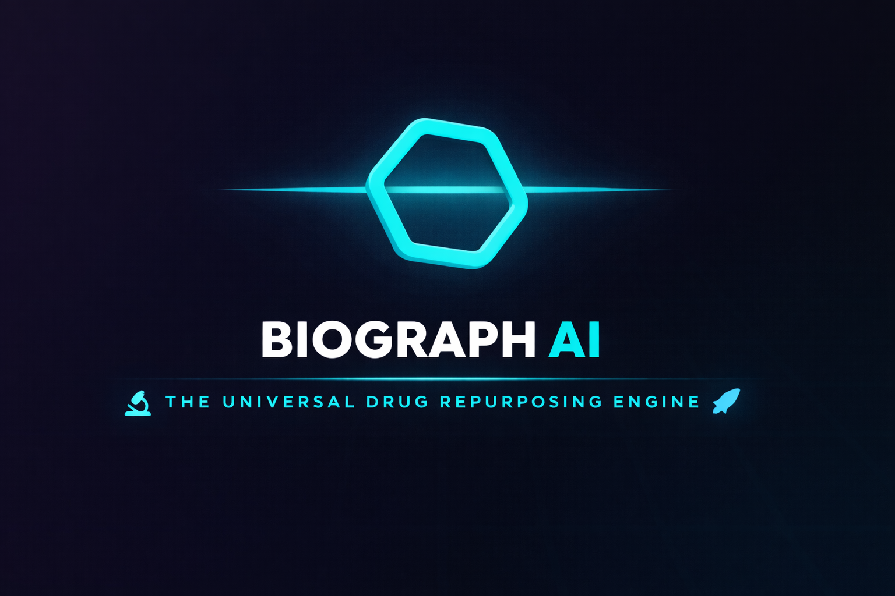
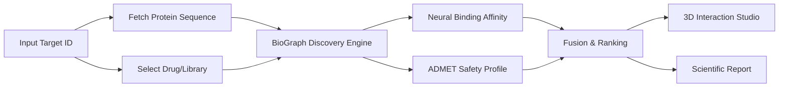
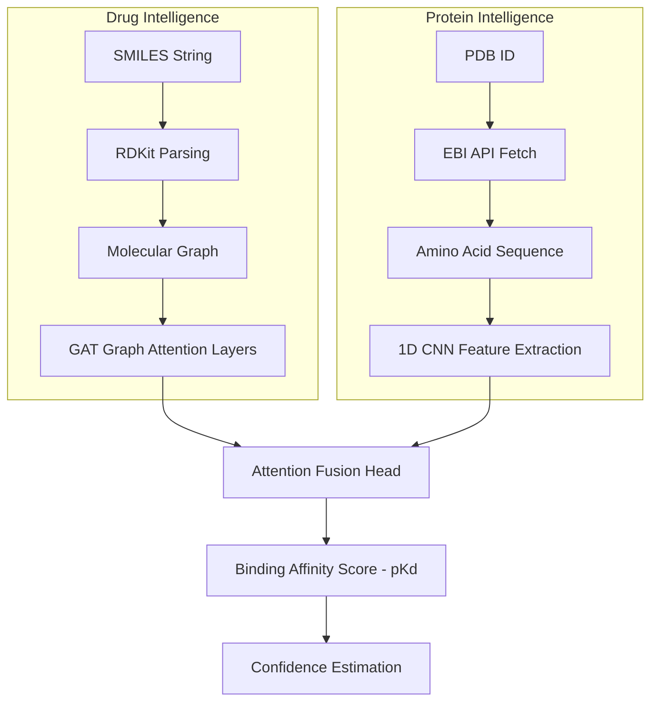

# 🧬 BioGraph Enterprise
## The Universal Drug Repurposing Engine v2.0

<p align="center">
  
</p>

**Advancing Medicine through Graph Intelligence**

BioGraph Enterprise is a next-generation AI-powered scientific discovery platform designed to discover new therapeutic purposes for existing drugs. By leveraging Graph Neural Networks (GNNs) and deep protein sequence intelligence, it transforms months of traditional research into minutes of computational inference.

---

### 🌌 Vision
BioGraph Enterprise aims to solve "unsolvable" medical cases by identifying existing FDA-approved drugs that can be repurposed for new targets. 

It integrates:
- **🧠 Graph Neural Networks:** Reasoning about molecular structures at the atomic level.
- **🧬 Protein Intelligence:** Analyzing target protein sequences for binding site compatibility.
- **🧪 Cheminformatics & ADMET:** Real-time safety and toxicity prediction.
- **🕹️ Interactive Discovery:** A high-performance dashboard for scientists to explore results and visualize 3D interactions.

---

### 🔬 Scientific Workflow

The platform follows a rigorous computational pipeline to ensure high-fidelity predictions.



---

### 🧠 AI & Data Pipeline

Technical breakdown of how data flows through the **DeepDrugNet_V4** architecture.



---

### 🚀 Key Platform Features

#### **1. Discovery Studio (3D Viewer)**
- **Multi-Mode Rendering:** Toggle between `Cartoon`, `Stick`, and `Surface` views to analyze binding pockets.
- **Pharmacophore Mapping:** Visualize active sites including Hydrophobes, Donors, and Acceptors directly on the 3D structure.
- **Dynamic Interaction:** Explore the spatial relationship between the candidate drug and the target protein.

#### **2. Graph Intelligence Mode**
- **Manual Mode:** Deep-dive into a single molecule by name or SMILES.
- **Auto Mode:** Scan the entire internal drug library for potential hits against a new target.
- **Upload Mode:** Batch process thousands of molecules via `.csv` or `.txt` supporting custom SMILES lists.

#### **3. ADMET Safety & Profiling**
- **Lipinski Compliance:** Automated checking of the "Rule of Five".
- **Drug-likeness (QED):** Computational estimation of how "drug-like" a molecule is.
- **Molecular Weight & LogP:** Real-time calculation of critical pharmacokinetic parameters.

#### **4. Scientific Reporting**
- **Professional PDF Export:** Generate lab-ready reports containing molecular images, 2D structures, and full AI diagnostics.
- **History Tracking:** Automatically save and review previous analysis sessions with persistent local storage.

---

### 📊 Data Library & Intelligence

BioGraph Enterprise is powered by a multi-layered data architecture that combines public databases with local intelligence.

- **Internal Drug Library:** Integrated SQLite database (`drugs.db`) pre-populated with a curated subset of FDA-approved and experimental compounds.
- **Dynamic Fetching:** Real-time integration with **PubChem** (via `PubChemPy`) and the **PDBe API** for automated retrieval of molecular structures and protein sequences.
- **Preprocessing Engine:** Handles SMILES validation, canonicalization, and graph conversion using `RDKit`.

---

### 🧪 Deep ADMET Descriptor Specs

The safety layer evaluates over 15+ molecular descriptors to ensure drug-likeness and low toxicity.

| Category | Descriptor | Critical Threshold / Description |
| :--- | :--- | :--- |
| **Basic Specs** | Molecular Weight (MW) | Optimized for < 500 Da (Lipinski Rule). |
| **Solubility** | LogP (Lipophilicity) | Balanced for membrane permeability (< 5.0). |
| **Polarity** | TPSA | Topographical Polar Surface Area (Ų) for BBB permeability. |
| **Flexibility** | Rotatable Bonds | Quantifies molecular entropy and binding adaptability. |
| **H-Bonding** | H-Donors/Acceptors | Crucial for specific target interaction affinity. |
| **Safety** | QED Score | Quantitative Estimate of Drug-likeness (0.0 to 1.0). |
| **Compliance** | Rule of 5 | Automated validation of Lipinski’s safety criteria. |

---

### 🤖 AI Reasoning & Clinical Interpretation

Going beyond raw scores, BioGraph uses an **LLM-powered reasoning engine** (Gemini 2.5 Flash/Pro) to provide scientific context.

- **Mechanism of Action (MoA):** AI-generated hypotheses on how the drug binds to the specific target residues.
- **Safety Risk Review:** Narrative analysis of potential side effects based on ADMET profiles.
- **Clinical Potential:** Estimation of repurposing feasibility (High/Medium/Low).
- **Interactive Drug Chat:** A specialized assistant to answer technical questions about any analyzed ligand.
- **Structure Optimization:** AI-driven suggestions for modifying candidate molecules to improve binding or safety.

---

### 🎨 Advanced User Experience Features

BioGraph Enterprise is designed for high-throughput scientific workflows with a focus on visual clarity and user engagement.

- **🌌 Holographic Visualization Engine:** Real-time feedback during deep-learning scans using glassmorphic hologram effects to visualize system state and progress.
- **⚡ Adaptive AI Thresholding:** Dynamically adjust the binding affinity sensitivity (pKd threshold) to filter "Active" hits based on specific project requirements.
- **💾 Persistent Research Workspace:** Integrated session memory and a **History Dropdown** that saves previous scans, allowing scientists to resume research across sessions.
- **📊 Interactive Data Analytics:** Dynamic Radar Charts and Bar Graphs for multidimensional ADMET profiling and comparative drug analysis.
- **🔍 Smart Search & Recognition:** Intelligent parsing of drug names, PDB IDs, and raw SMILES with automatic PubChem lookup for unformatted inputs.

---

### 🛠️ Discovery Intelligence Modules

Beyond core analysis, the platform includes specialized modules for end-to-end drug discovery.

| Module | Capability | Tech Provider |
| :--- | :--- | :--- |
| **Studio 3D** | Multi-view (Cartoon/Stick/Surface) + Pharmacophore mapping. | 3Dmol.js |
| **Batch Engine** | High-speed inference for `.csv` and `.txt` libraries. | Pandas / PyTorch |
| **Safety Guard** | Real-time Lipinski and QED assessment. | RDKit |
| **Logic Hook** | Centralized state management for seamless UI transitions. | React Hooks |
| **Progress API** | Server-Sent Events (SSE) compatible live tracking. | FastAPI |

---

### 🛠️ Technology Stack

#### **Frontend** (Glassmorphic Dashboard)
- **Framework:** React + Vite
- **3D Visualization:** `3Dmol.js` for protein structure exploration.
- **Animations:** `Framer Motion` for smooth transitions.
- **Data Viz:** `Recharts` for ADMET profiling.

#### **Backend** (Discovery Engine)
- **Framework:** FastAPI
- **AI Libraries:** `PyTorch`, `PyTorch Geometric` (GNNs).
- **Cheminformatics:** `RDKit`, `PubChemPy`.
- **Database:** SQLite (Drug library).
- **Reporting:** `ReportLab` (PDF Engine).

---

### 📂 Project Structure

```text
BioGraph_Enterprise/
├── backend/                # FastAPI Discovery Engine
│   ├── main.py             # Entry point
│   ├── modules/            # Core logic
│   │   ├── ai_model.py     # GNN implementations (DeepDrugNet_V4)
│   │   ├── admet.py        # Safety & Toxicity logic
│   │   ├── chemistry.py    # SMILES & Protein processing
│   │   └── report_generator.py # PDF Engine
│   ├── routers/            # API Endpoints (Analysis, Upload, Reports)
│   └── drugs.db            # SQLite Database
├── frontend/               # React Dashboard
│   ├── src/
│   │   ├── components/     # UI Design & 3D Viewer (Studio)
│   │   ├── pages/          # Dashboard & About
│   │   └── api/            # Backend communication
└── README.md
```

---

### 🚀 Installation & Setup

#### **1. Clone the Repository**
```bash
git clone https://github.com/BioGraphAi/BioGraph_Enterprise.git
cd BioGraph_Enterprise
```

#### **2. Backend Setup**
```bash
cd backend
python -m venv venv
# Windows
venv\Scripts\activate
# Linux/Mac
source venv/bin/activate
pip install -r requirements.txt
python main.py
```

#### **3. Frontend Setup**
```bash
cd ../frontend
npm install
npm run dev
```

---

### 🏁 Platform Evolution & Scientific Impact
 
- **⚡ Accelerated Discovery Pipeline:** Reduce the pre-screening phase of drug discovery from months of wet-lab work to minutes of AI-driven inference.
- **🛡️ Evidence-Based Repurposing:** Generate high-confidence leads for existing medications to treat rare or resistant diseases.
- **🧬 Democratizing Computational Biology:** Providing researchers with professional-grade GNN and 3D visualization tools without complex CLI overhead.
- **📉 Risk & Cost Mitigation:** Integrated toxicity filtering and ADMET safety alerts minimize the risk of late-stage clinical failures.

---

### 🔮 Future Roadmap
- **[Phase 1] Multi-Protein Complexing:** Support for protein-protein interaction (PPI) analysis.
- **[Phase 2] Real-time Dynamics:** Integration of MD (Molecular Dynamics) snapshots into the 3D Viewer.
- **[Phase 3] Federated Discovery:** Secure multi-institution data sharing for training larger GNN models.

---

### 👤 Credits & Authors
Created by **BioGraph AI**.
*Advancing Medicine through Graph Intelligence.*

